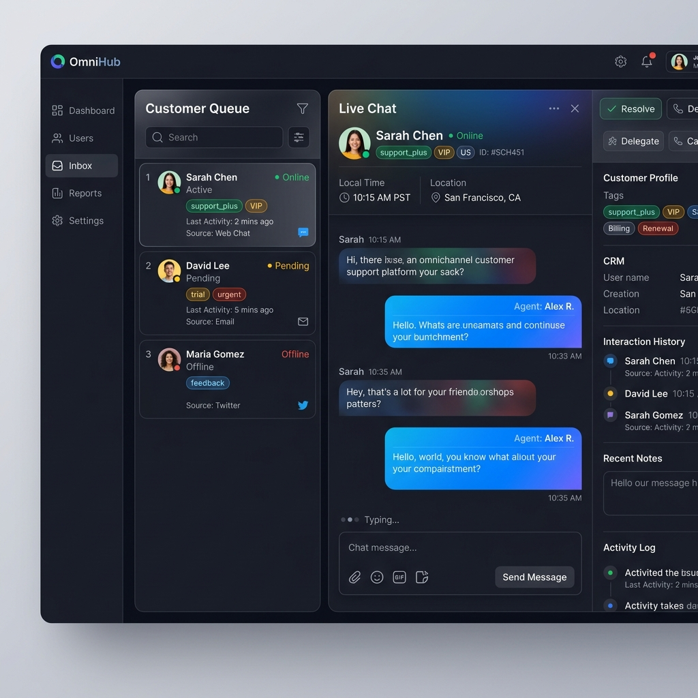
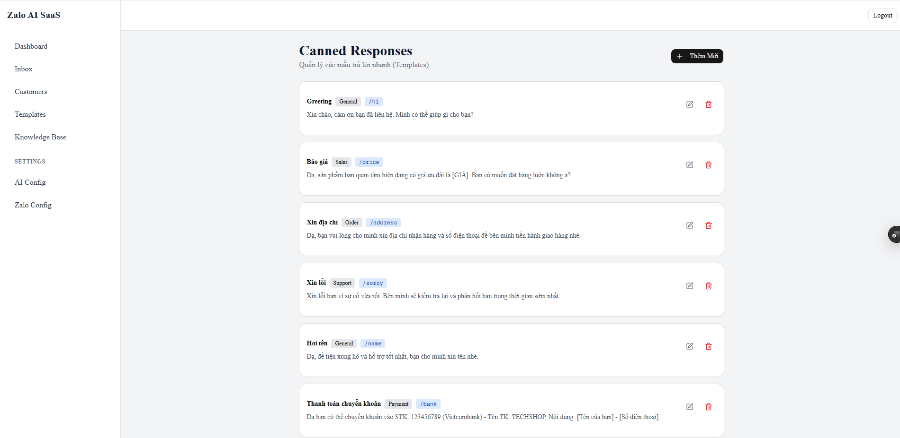
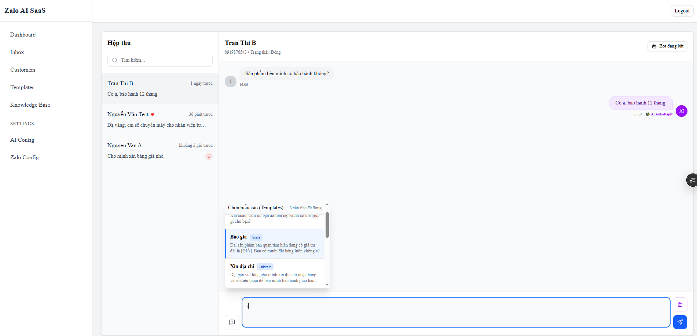
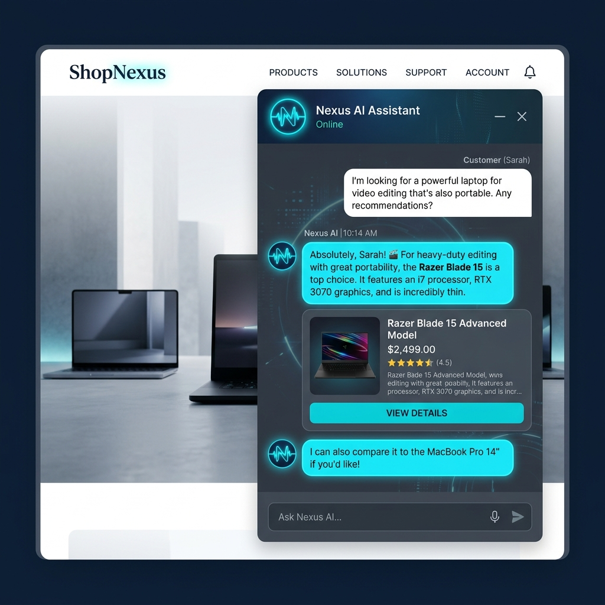
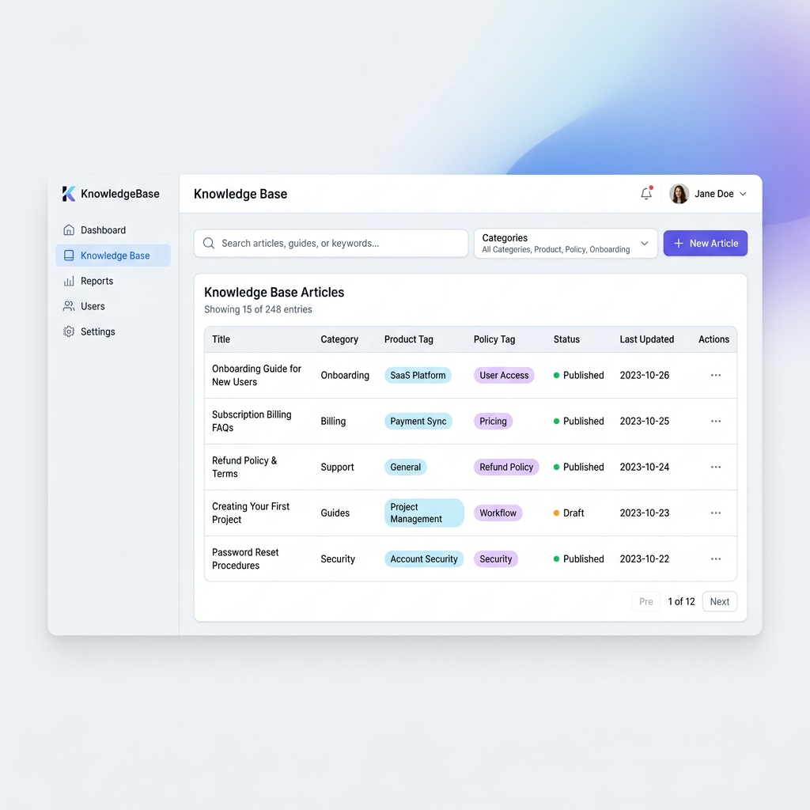

# 🚀 AI-Powered Customer Support SaaS (Zalo OA Simulation)


Dự án này là một hệ thống SaaS (Software as a Service) Hỗ trợ Khách hàng tích hợp Trí tuệ Nhân tạo (AI), được thiết kế mô phỏng theo nền tảng **Zalo Official Account (Zalo OA)**. 
Hệ thống cho phép các doanh nghiệp quản lý tin nhắn của khách hàng đa kênh, đồng thời sử dụng AI để tự động trả lời, phân tích ngữ cảnh và đề xuất câu trả lời dựa trên kho tri thức (Knowledge Base) độc quyền.

---

## ✨ Những Tính Năng Nổi Bật (Key Features)

### 1. 💬 Giao Diện Quản Lý Tin Nhắn (Inbox Dashboard)
Giao diện nhắn tin và quản lý tương tác khách hàng theo thời gian thực mô phỏng Zalo OA. Cung cấp cái nhìn toàn cảnh về thông tin khách hàng, lịch sử chat và các công cụ hỗ trợ cho nhân viên (Tags, Ghi chú, Canned Responses).



#### Canned Responses




### 2. 🧠 AI Chatbot & Tích hợp RAG (Retrieval-Augmented Generation)
Tích hợp trí tuệ nhân tạo (AI) đột phá có khả năng tự động đọc hiểu tài liệu nội bộ của doanh nghiệp (được vector hóa thông qua `pgvector`). AI tự động nắm bắt ngữ cảnh hội thoại, đối chiếu với cơ sở dữ liệu và trả lời câu hỏi của khách hàng một cách thông minh, chính xác, tự nhiên.



### 3. 📚 Quản Lý Kho Tri Thức (Knowledge Base)
Hệ thống cung cấp một giao diện quản lý dữ liệu huấn luyện cho AI cực kỳ tiện lợi. Doanh nghiệp có thể tạo mới, import hàng loạt qua file CSV và phân loại dữ liệu (Sản phẩm, Chính sách, Thông tin chung) để AI học và trả lời dựa trên dữ liệu đó.



### 4. ⚙️ AI Configuration & Cá Nhân Hóa
Cấu hình "tính cách" của AI thông qua System Prompt. Bạn có thể định hình giọng văn của AI (Lịch sự, Thân thiện, Chuyên nghiệp) và tùy biến cách AI xưng hô với khách hàng.

---

## 🛠️ Công Nghệ Sử Dụng (Tech Stack)

- **Frontend:** Next.js (App Router), TypeScript, Tailwind CSS, shadcn/ui.
- **Backend:** Node.js / Express.js, TypeScript, Prisma ORM.
- **Database & AI:** PostgreSQL, `pgvector` (Lưu trữ và truy xuất dữ liệu vector cho AI), @xenova/transformers (Local Embedding).

## 🚀 Hướng Dẫn Chạy Môi Trường Phát Triển (Local Development)

### 1. Khởi Động Cơ Sở Dữ Liệu
Dự án yêu cầu cài đặt Docker. Chạy lệnh sau để khởi động PostgreSQL (tích hợp sẵn pgvector):
```bash
docker-compose up -d
```

### 2. Cài Đặt & Chạy Backend
```bash
cd backend
npm install
npx prisma db push  # Cập nhật schema vào database
npm run dev         # Khởi động server (localhost:8080)
```
> **Tip:** Bạn có thể chạy `npm run seed` để nạp sẵn dữ liệu mẫu (Khách hàng, Đoạn chat, Knowledge Base) vào database.

### 3. Cài Đặt & Chạy Frontend
```bash
cd frontend
npm install
npm run dev         # Khởi động giao diện Next.js (localhost:3000)
```

---
*Dự án được phát triển nhằm mục đích cung cấp giải pháp CSKH tự động hóa thông minh cho các doanh nghiệp vừa và nhỏ.*
