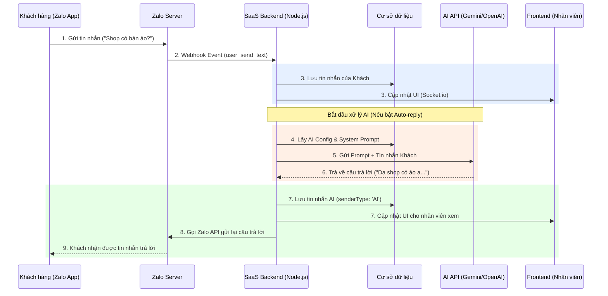

# Luồng hoạt động của Chatbot AI (Tích hợp Zalo)

Dưới đây là sơ đồ mô tả cách một AI Chatbot (như OpenAI, Gemini) thực tế hoạt động khi được tích hợp vào hệ thống Zalo OA của bạn.

## Sơ đồ luồng (Sequence Diagram)

## Giải thích chi tiết các bước:

1. **Khách hàng nhắn tin:** Người dùng mở ứng dụng Zalo và nhắn tin cho trang Zalo OA của bạn.
2. **Webhook kích hoạt:** Zalo Server bắt được tin nhắn và lập tức bắn một HTTP POST request (Webhook) về server của bạn.
3. **Lưu trữ & Hiển thị:** Backend của bạn (`zalo.controller.ts`) nhận dữ liệu, lưu vào database và báo cho Frontend (màn hình Inbox của nhân viên) cập nhật realtime thông qua `Socket.io`.
4. **Kiểm tra trạng thái AI:** Hệ thống kiểm tra xem tính năng AI Auto-Reply có đang được bật hay không và lấy cấu hình (API Key, Prompt - *VD: "Bạn là nhân viên bán hàng..."*).
5. **Gửi yêu cầu tới AI:** Backend gộp **System Prompt** và **Tin nhắn của khách** thành một đoạn văn bản (context) rồi gọi sang API của các bên cung cấp AI (như Google Gemini, OpenAI ChatGPT).
6. **AI phân tích & sinh văn bản:** AI đọc hiểu yêu cầu và trả về một đoạn text trả lời phù hợp nhất.
7. **Lưu vết:** Hệ thống lưu câu trả lời này vào Database với loại người gửi là `AI` để nhân viên có thể xem lại AI đã nói gì với khách.
8. **Trả lời khách hàng:** Backend gọi **Zalo OpenAPI (Gửi tin nhắn)** để đẩy câu trả lời của AI quay ngược lại cho người dùng. (Nếu đang dùng Zalo Mock, bước này sẽ là emit dữ liệu cho Zalo Mock hiển thị).
9. **Khách nhận tin:** Khách hàng thấy tin nhắn phản hồi ngay lập tức trên app Zalo của họ.

> [!WARNING]
> **Thực trạng code hiện tại của bạn:**
> Khi xem qua file `backend/src/controllers/zalo.controller.ts`, mình thấy bạn đã viết logic từ bước **1 đến bước 7** cực kỳ chuẩn xác. 
> Tuy nhiên, code hiện tại đang **thiếu bước số 8**. Nghĩa là AI đã sinh ra được câu trả lời và đã lưu vào DB, nhân viên cũng thấy trên Inbox, nhưng khách hàng (client) thì không nhận được vì bạn chưa gọi Zalo API (hoặc Mock webhook) để trả tin về Zalo App.
